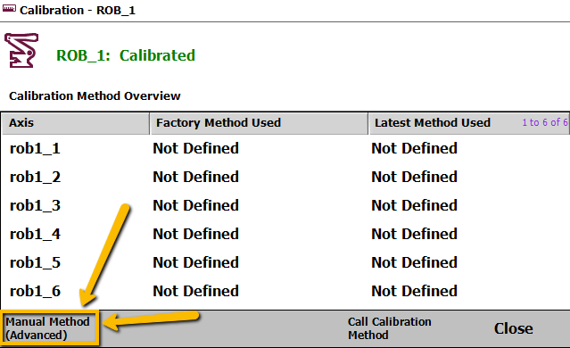
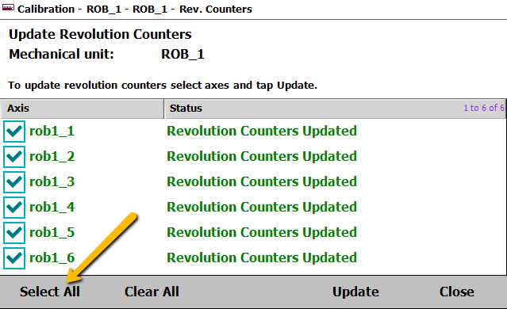

# Updating Revolution Counters 
### This procedure should be performed after changing the batteries

---

This guide walks you through manually calibrating an ABB robot using the teach pendant.  
Each step includes a reference image.

---

  
**Jog the robot:** Using the teach pendant, move each axis until the physical calibration marks are aligned with the stationary marks on the robot's housing or controller. This is crucial for synchronization.  

---

  
**Navigate to the Service Menu:** On the teach pendant, tap the drop-down menu in the top left corner to open the service window.  

---

  
**Select Calibration:** From the service menu, tap *Calibration*.  

---

  
**Choose the Mechanical Unit:** Select the specific robot or mechanical unit that needs calibration.  

---

  
**Access Calibration Parameters:** Tap *Manual Method* in the bottom left corner of the screen.  

---

  
**Rev. Counters:** In the *Rev. Counters* tab, select *Update Revolution Counters*.  

---

  
**Select the Mech Unit:** Choose the Mechanical Unit and tap *OK*.  

---

  
**Select Axes for Update:** Check the boxes for the specific axes you want to update, or tap *Select All* to include all of them.  

---

  
**Perform the Update:** Tap *Update* to confirm the selected axes and begin the revolution counter update.  

---

**Confirm and Close:** Once the update is complete, tap *Okay* or *Close* to exit the calibration session.  
**Verify the Update:** Check the jogging window on the teach pendant to ensure the robot's axes are now close to the 0° position.  

---

### The maintenance manual below contains a "Fine Calibration" method that is not necessary for updating revolution counters after a battery swap.

---

📄 [ABB Maintenance Manual (PDF)](./IRB120_Manual.pdf)
