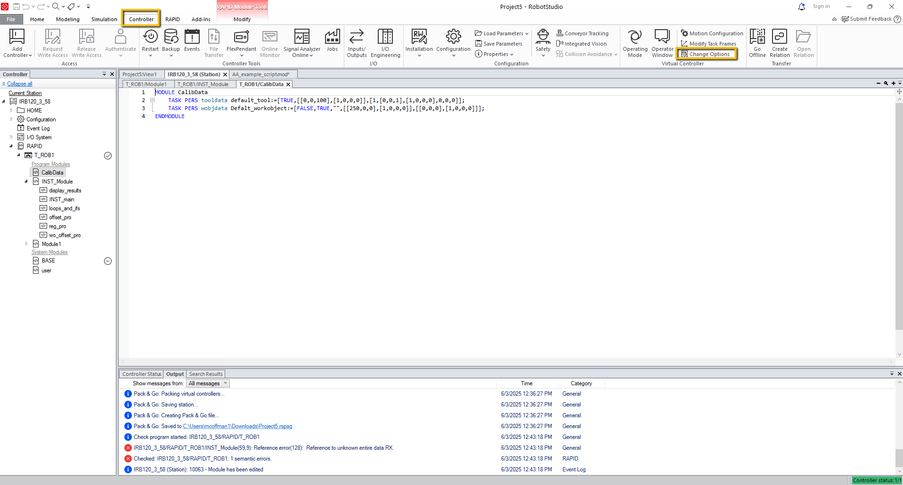
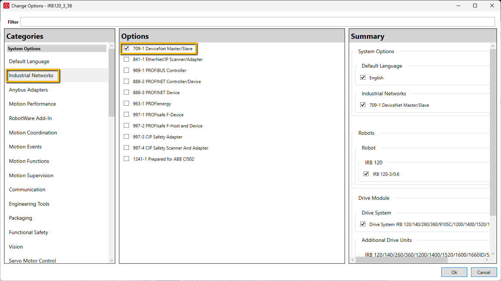
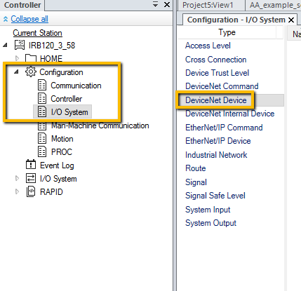
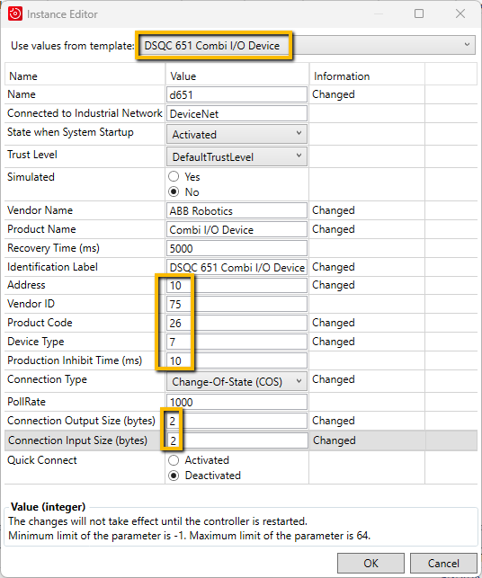
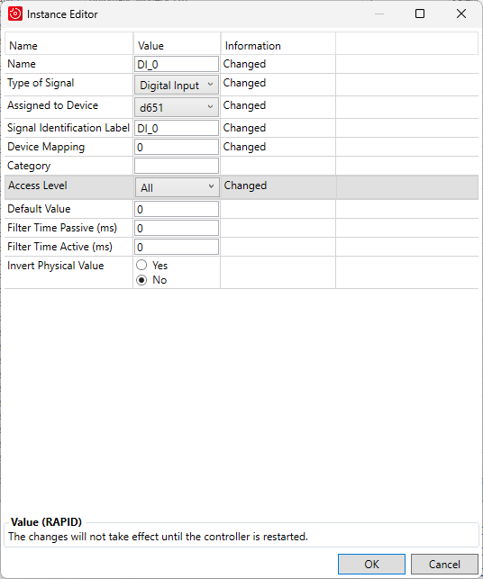
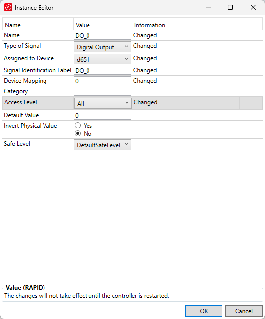

# Configuring DeviceNet on an ABB Virtual Controller

This guide walks through the steps to configure DeviceNet communication on an ABB robot controller.

---

## 1. Enable DeviceNet in Controller Options

1. Open the **Controller** tab.
2. Click **Change Options**.

3. In the list of options, expand **Industrial Networks**.
4. Check the box for **109-1 DeviceNet**.

5. **Restart the controller** to apply the changes.

---

## 2. Add a New DeviceNet Device

1. In the left panel, go to **Configuration**.
2. Double-click **I/O System**.
3. Right-click on **DeviceNet Device** and select **New DeviceNet Device**.

4. Configure the device as shown below:

5. **Restart the controller** again to finalize the configuration.

---

## 3. Create Input and Output Signals

### Create and Configure Input Signals

1. Right-click **Signals** and select **New Signal**.
2. Configure your **inputs** as shown below:

---

### Create and Configure Output Signals

1. Continue by configuring your **outputs** as shown below:

---

## ✅ Done!

Your ABB controller is now configured to use DeviceNet I/O. Be sure to verify the signal mapping with your connected DeviceNet devices.

---

