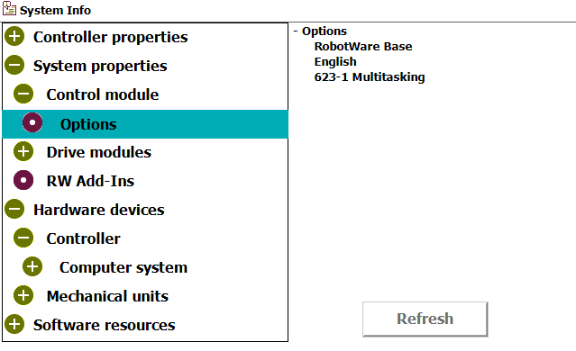
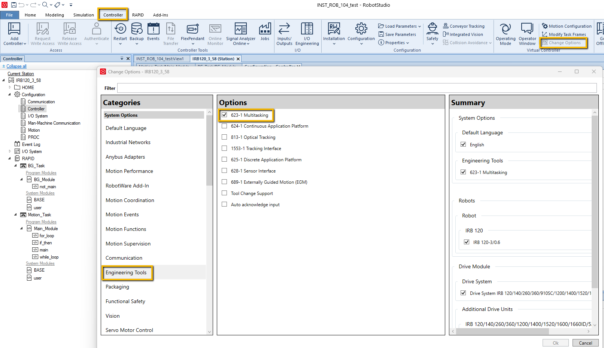
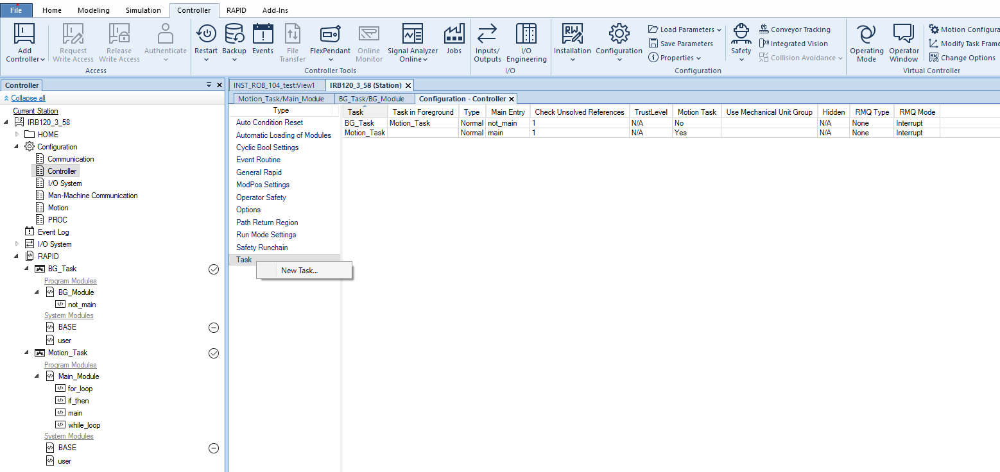
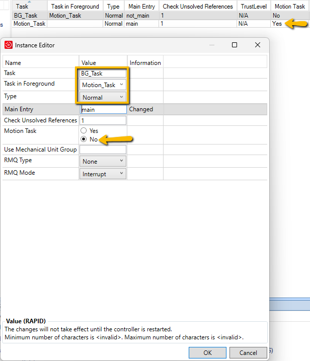

### Setup
1. Make sure you have multitaking
    - On a **Real Robot** just go to your system properties and make sure the option is installed

        

    - on a **Virtual Robot** you can `Change Options` and add it
    - you will find it in the `Controller` --> `Change Options` --> `Engineering Tools`

        

---

2. Create a new task
    - In the **Controller** tab go to `Configuration` --> `Cotroller` --> `Task` then right click and select `New Task...`
        
        

    - Setup your new task as shown

        
    
    - **Remember:** you can only have **One Motion Task**

---

3. Reboot your robot and you are ready to start multitasking. Below are a couple sample modules that you can put in your tasks to test them
 
> **BG_Module:**This module is for the background task
```Rapid
MODULE BG_Module
    PERS num testvar := 0;
     
    PROC not_main()
        !Main Background Routine
        WaitTime 3;
        testvar := 1;
        WaitTime 3;
        testvar := 2;
        WaitTime 3;
        testvar := 0;
    ENDPROC
ENDMODULE
```

> **Main_Module:**This module is for the Motion task
```Rapid
MODULE Main_Module
    PERS num testvar;
    VAR num myvar;
    
    PROC main()
        !Main Motion Routine
        !TPWrite "IT WOKED!!!";
        !WaitTime 2;
        if_then;
    ENDPROC
    
    !###################################
    !        if | else if | else
    !###################################
    PROC if_then()
        IF testvar = 1 THEN
            ! what to do
            TPWrite "ONE";
        ELSEIF testvar = 2 THEN
            ! what to do
            TPWrite "TWO";
        ELSE
            ! what to do
            TPWrite "ZERO";
        ENDIF
        WaitTime 3;
        TPErase;
    ENDPROC
ENDMODULE
```

