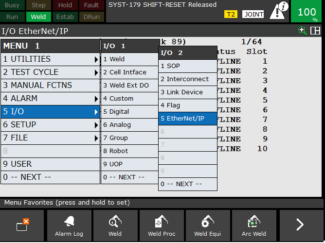
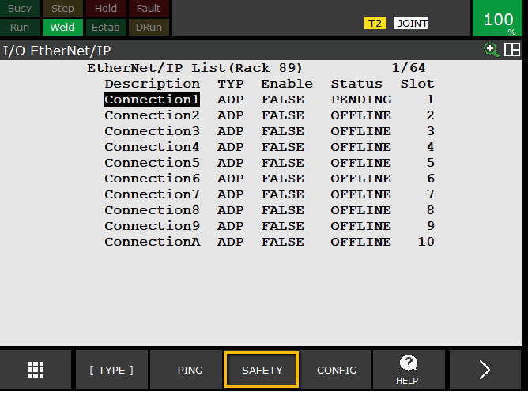
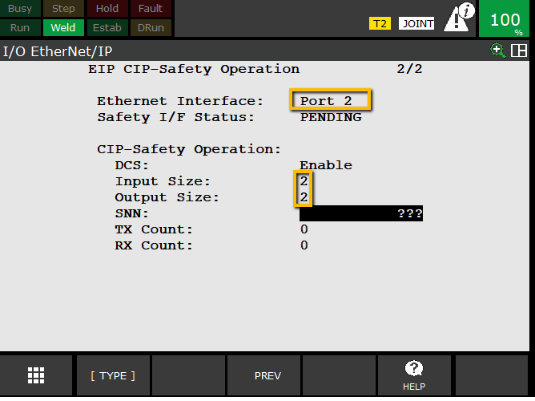

# Configure Ethernet/IP Adapter on Robot

> “With communication established, we’ll configure the Ethernet/IP adapter that allows data exchange between the PLC and robot.”

**Steps**
1. Teach pendant: `MENU → I/O → Ethernet/IP`  
   - If missing, robot requires licensed Ethernet/IP option (R784 if working in Roboguide)  

2. Select **Connection1** and press **F4 (Config)**  
3. Set:
   - **Input Size:** `8 words`  
   - **Output Size:** `8 words`  
   - *(1 word = 16 bits)*  

4. Confirm **Adapter Enabled = TRUE** and **Status = RUNNING**  
5. Verify **Scanner IP** auto-populates to PLC IP  
6. Confirm **Requested Packet Interval (RPI)** = `30 ms` 

If using safety we also need to configure it
1. From the **I/O EtherNet/IP** screen select **F3 (Safety)**

2. Select the same port we setup earlier
3. I usually leave the input and output size as 2, but remember this is in bytes not words.

**Checkpoint**
> For basic comms, next we will configure the [Fanuc Module on PLC](https://github.com/mcoffman1/basic_shared/tree/main/Allen%20Bradley/Communication%20to%20Fanuc). 
> If you are following this guide to setup **Remote Control** I usually like to setup my user operator panel. To do that you must choose either **RSR**, **PNS**, or [Other](https://github.com/mcoffman1/industrial_robotics_shared/tree/main/Fanuc/Remote%20Control%20Methods/Other). *Links will be added for RSR, and PNS soon.

---