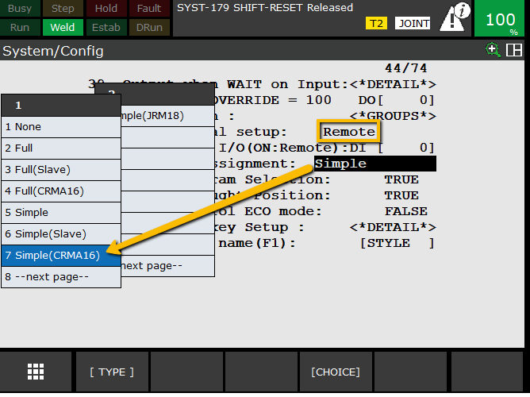

# Robot System Configuration for external control
> **Note:** The following is for setting up remote control and is not necessary for simple data exchange

**Steps**
On the teach pendant, select:  
`MENU → NEXT → SYSTEM → CONFIG`  
 

The following are optional config examples. **Bold** items are necessary for remote control of the robot.
   1. #1 Use Hot Start = TRUE
      - allows the robot to resume production from where it was stopped after a power cycle, preserving the robot's previous state, including I/O, teach pendant displays, and programs
   2. **#7 Enable UI Signals = TRUE**  
      - Allows PLC to start/stop the robot externally
   3. #9 CSTOPI for ABORT = TRUE
      -  When this input is true it clears the queue of programs to run, making it useful for external stops or program switching. Dependant on abort system variable.
      
   4. #14 WAIT timeout = 10 sec
   5. line #30-35 are robot status outputs to the PLC. Set 30-33 to 21-24  
   
   6. **#42 Remote/Local Setup** and set to **REMOTE**  
      - Enables external start/stop control 
   7. **#44 UOP auto assignment:** Simple (CRMA16)
   
      ##### Assignment options:
      The UOP Auto Assignment setting typically offers several choices, which define the communication standard and how signals are allocated. Common options include:
      - **None:** The robot's UOP signals are not automatically assigned. This requires the user to manually map each individual UOP signal to the PLC's I/O points via the I/O configuration menu.
      - **Simple:** Automatically maps a basic set of UOP signals necessary for program control, like Start, Stop, and Hold, often to the robot's built-in I/O terminals (e.g., CRMA16).
      - **Full:** Automatically assigns a more comprehensive set of UOP signals, including additional status and control signals, to a specified range of I/O points.
      - **Full (CRMA16):** A specific option that performs a "Full" assignment using the robot's physical CRMA16 connector, which is a common hardwired I/O interface on FANUC controllers.
      - **Simple (CRMA16):** Performs a "Simple" assignment using the CRMA16 connector.

> Next I usually [Setup Host Communication](https://github.com/mcoffman1/industrial_robotics_shared/tree/main/Fanuc/Ethernet%20Setup/Setup%20Hot%20Comm)

---