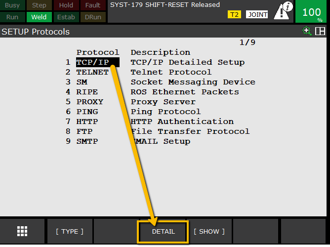
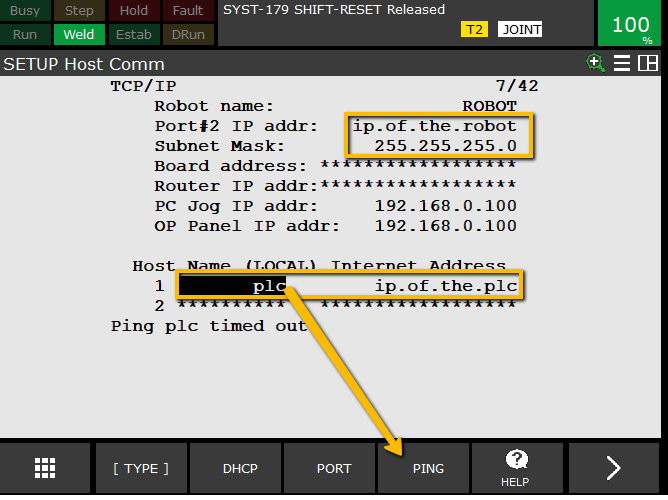

# Configure Host Communications (Robot IP Address)

> “Now we’ll set the robot’s IP address”

**Steps**
1. On teach pendant: `MENU → SETUP → HOST COMM` 
2. Select `TCP/IP` and press `Detail` to continue

**Note:** Fanuc recommends using port #2 for communications to a rockwell PLC. Port #2 is optimized for ethernet IP. 

2. Assign a **Robot Name** (e.g., `Robot01`)  
3. Set a **Static IP Address** (e.g., `the.robot.ip.address`) — ensure the first three octets match the PLC and PC  
4. Subnet Mask: `your.subnet.mask.0`  
5. Add connected devices (PLC + PC IPs)  
6. Press **F5 Initiate** to apply settings (or power cycle controller)  
7. Verify communication:
   - `F4 Ping` → PLC IP → expect “Ping Succeeded”  
   - If timed out → check network cable or subnet configuration  

> Next we will [Configure the Ethernet Adapter]() but you should be able to ping the PLC from this screen once commnication has been setup on both ends.

---