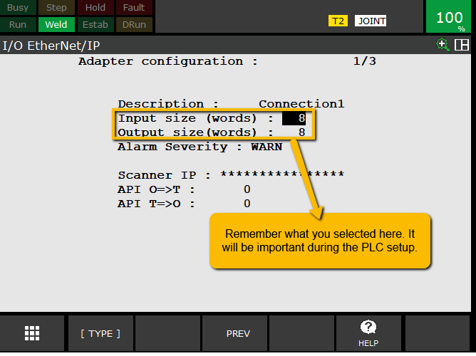
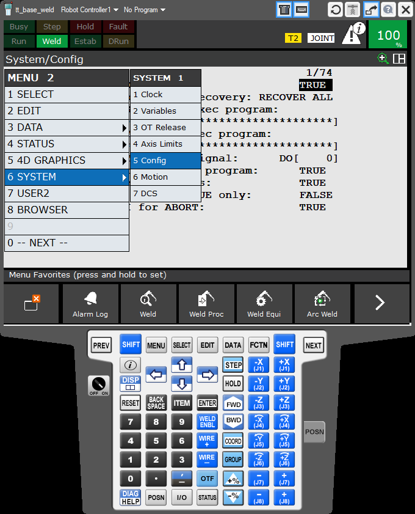
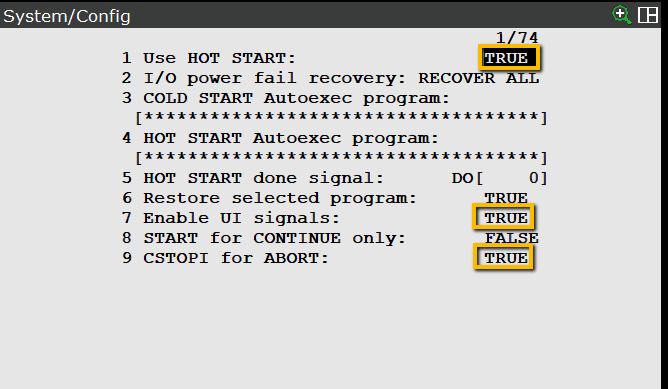
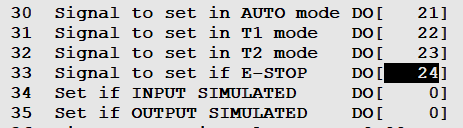

# Fanuc Ethernet/IP Setup

---

### 1. Configure Host Communications (Robot IP Address)

> “Now we’ll set the robot’s IP address and verify its connection to the PLC and PC.”

**Steps**
1. On teach pendant: `MENU → SETUP → HOST COMM` 
2. Select `TCP/IP` and press `Detail` to continue

**Note:** Fanuc recommends using port #2 for communications to a rockwell PLC. Port #2 is optimized for ethernet IP. 

2. Assign a **Robot Name** (e.g., `Robot01`)  
3. Set a **Static IP Address** (e.g., `the.robot.ip.address`) — ensure the first three octets match the PLC and PC  
4. Subnet Mask: `your.subnet.mask.0`  
5. Add connected devices (PLC + PC IPs)  
6. Press **F5 Initiate** to apply settings (or power cycle controller)  
7. Verify communication:
   - `F4 Ping` → PLC IP → expect “Ping Succeeded”  
   - If timed out → check network cable or subnet configuration  

**Checkpoint**
> Robot successfully ping PLC on the same network.

---

### 2. Configure Ethernet/IP Adapter on Robot

> “With communication established, we’ll configure the Ethernet/IP adapter that allows data exchange between the PLC and robot.”

**Steps**
1. Teach pendant: `MENU → I/O → Ethernet/IP`  
   - If missing, robot requires licensed Ethernet/IP option (R784 if working in Roboguide)  
![eth ip menu]](pics/pic7.png)
2. Select **Connection1** and press **F4 (Config)**  
3. Set:
   - **Input Size:** `8 words`  
   - **Output Size:** `8 words`  
   - *(1 word = 16 bits)*  

4. Confirm **Adapter Enabled = TRUE** and **Status = RUNNING**  
5. Verify **Scanner IP** auto-populates to PLC IP  
6. Confirm **Requested Packet Interval (RPI)** = `30 ms` 

If using safety we also need to configure it
1. From the **I/O EtherNet/IP** screen select **F3 (Safety)**

2. Select the same port we setup earlier
3. I usually leave the input and output size as 2, but remember this is in bytes not words.

**Checkpoint**
> Next we will configure the PLC unless you are doing remote control. For remote control continue to section 3

---

---

### 3. Robot System Configuration for external control
> **Note:** The following is for setting up remote control and is not necessary for simple data exchange

**Steps**
On the teach pendant, select:  
`MENU → NEXT → SYSTEM → CONFIG`  
 

The following are optional config examples. **Bold** items are necessary for remote control of the robot.
   1. #1 Use Hot Start = TRUE
      - allows the robot to resume production from where it was stopped after a power cycle, preserving the robot's previous state, including I/O, teach pendant displays, and programs
   2. **#7 Enable UI Signals = TRUE**  
      - Allows PLC to start/stop the robot externally
   3. #9 CSTOPI for ABORT = TRUE
      -  When this input is true it clears the queue of programs to run, making it useful for external stops or program switching. Dependant on abort system variable.
      
   4. #14 WAIT timeout = 10 sec
   5. line #30-35 are robot status outputs to the PLC. Set 30-33 to 21-24  
   
   6. **#42 Remote/Local Setup** and set to **REMOTE**  
      - Enables external start/stop control 
   7. **#44 UOP auto assignment:** Simple (CRMA16)
   
      ##### Assignment options:
      The UOP Auto Assignment setting typically offers several choices, which define the communication standard and how signals are allocated. Common options include:
      - **None:** The robot's UOP signals are not automatically assigned. This requires the user to manually map each individual UOP signal to the PLC's I/O points via the I/O configuration menu.
      - **Simple:** Automatically maps a basic set of UOP signals necessary for program control, like Start, Stop, and Hold, often to the robot's built-in I/O terminals (e.g., CRMA16).
      - **Full:** Automatically assigns a more comprehensive set of UOP signals, including additional status and control signals, to a specified range of I/O points.
      - **Full (CRMA16):** A specific option that performs a "Full" assignment using the robot's physical CRMA16 connector, which is a common hardwired I/O interface on FANUC controllers.
      - **Simple (CRMA16):** Performs a "Simple" assignment using the CRMA16 connector.

**Checkpoint**
> Confirm UI Signals and Remote Mode are both active before continuing.

---