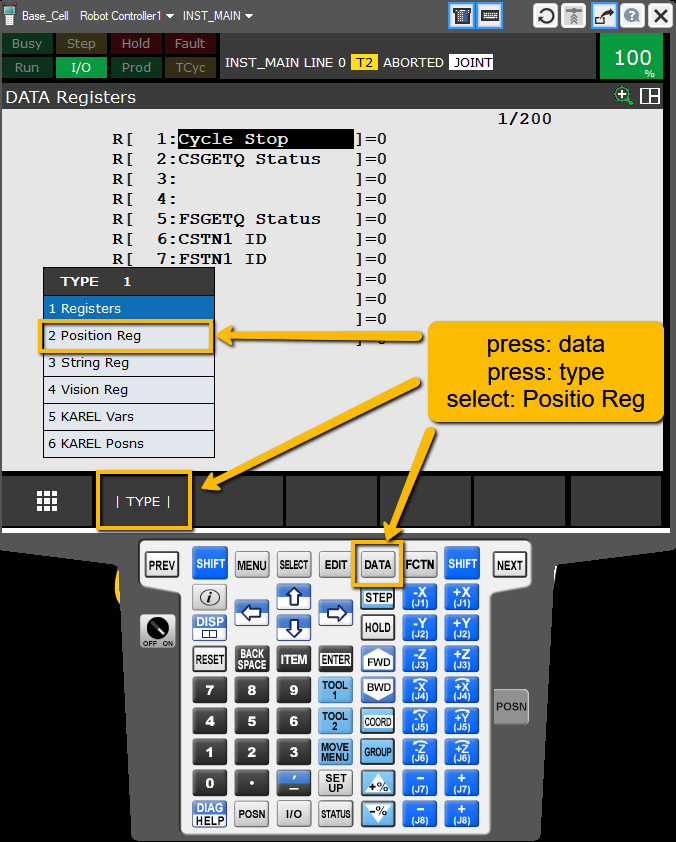
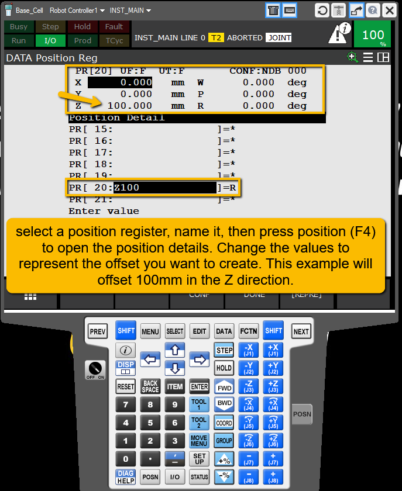
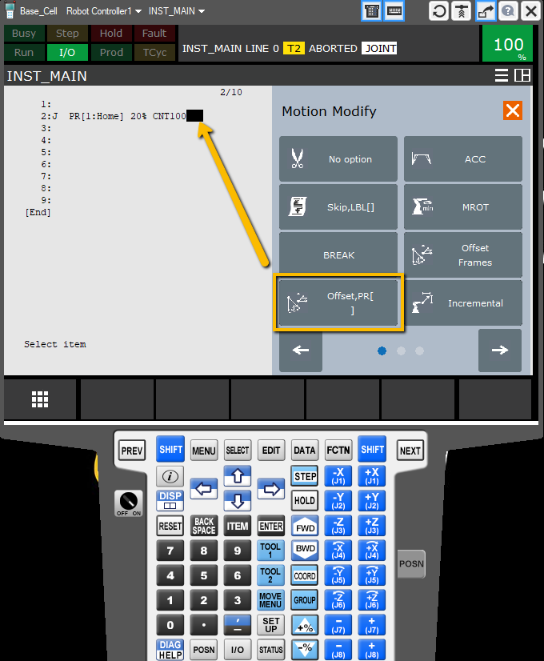
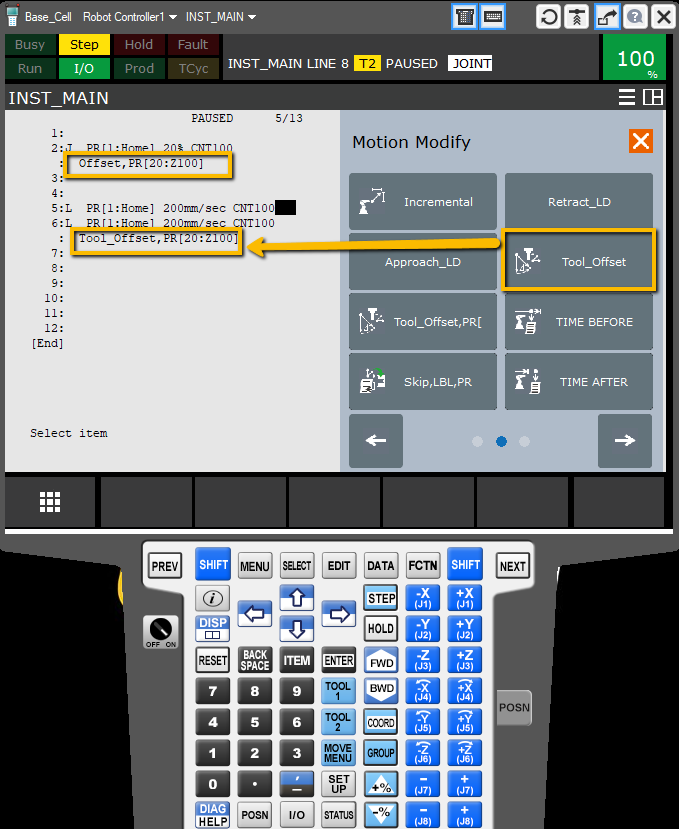

# Fanuc Adding Offsets 

---

This is a quick guide for adding an offset to a point

---

### 🟢 Step 1: Create a Position register to store your offset data

---

#### first go to the position register screen

---

---

#### Then name a position register and store the offset data in the position register. You can offset in multiple directions/rotations at the same time if you choose.

---

---

### 🟢 Step 2: Apply the offset to a point

---

#### To add the offset to the point, click the end of the point and add a PR offset to the end.

---

---

#### There are multiple offset options. This example shows how to offset in two different coordinate systems. Make sure the robot has 100mm clearence in the positive Z of both coordinate systems before running the program, and always test in a simulated enviroment first.

---

---