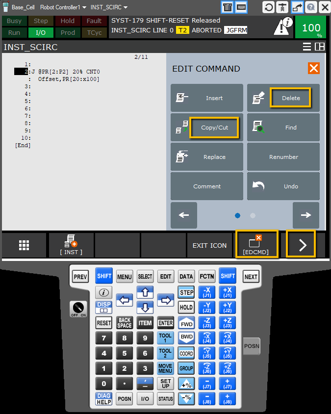
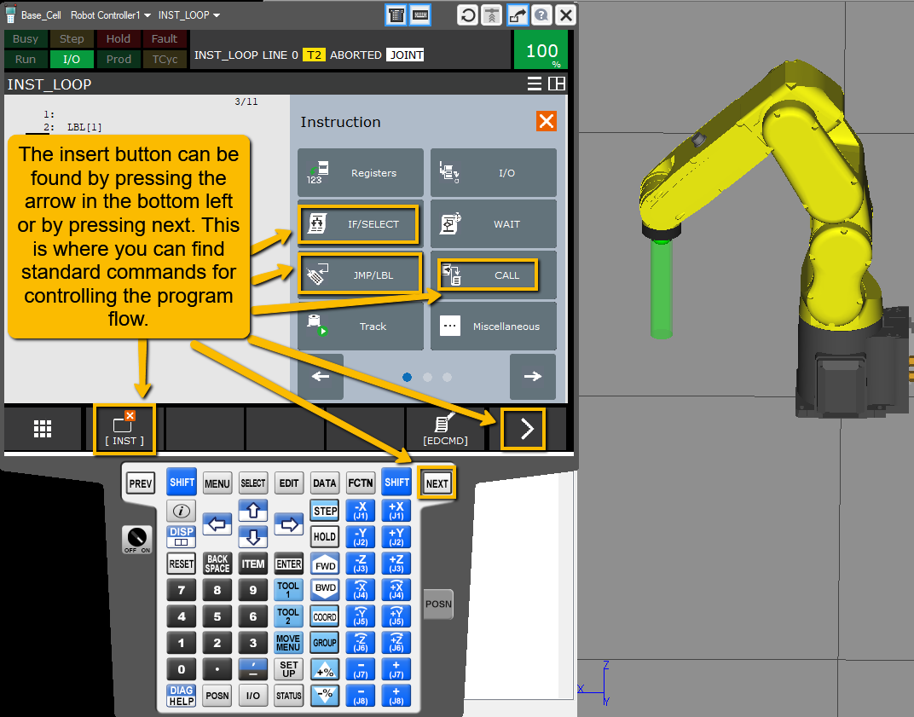
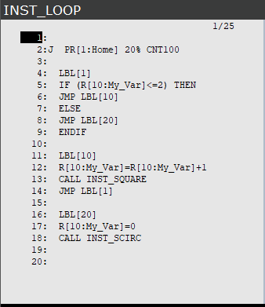
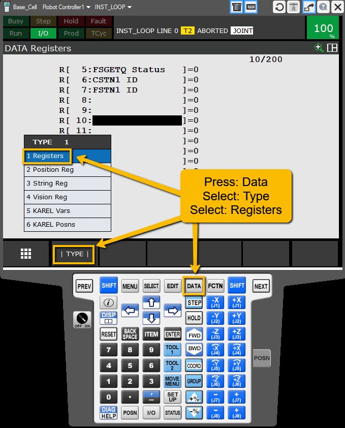
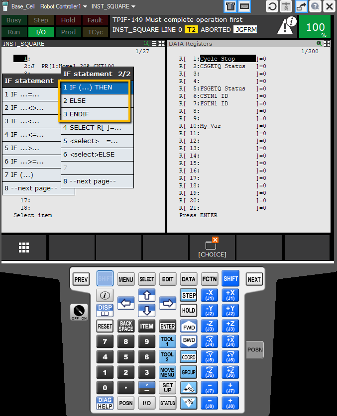
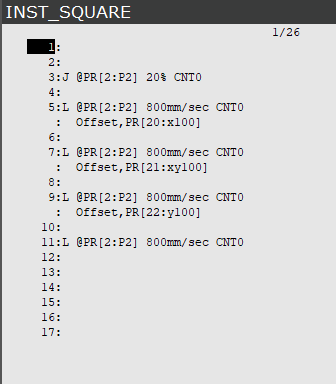
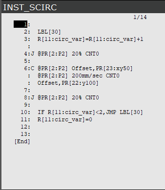

# Fanuc Program Flow (if, else, loop)
This guide shows where to find different tools for controlling the flow of your programs on a Fanuc robot

---

## Useful tools
Many usefull tools for inserting lines, deleteing, cutting, copying, and pasting can be found in the EDCMD menu. You may have to hit the **>** in the bottom right corner then hit ```EDCMD``` to enter the menu.


---

## Program Flow
Most commands to control program flow are found in the ```INST``` menu


---

Using the commands in this menu you can create programs like the following:


---

Commbine ```JMP LBL``` with the use of variables (known as registers) to create loops and call other programs.


---

Name the register and change the value of the variable, but do not forget to remember the number. The registers will be called in the program by number. For a good example of how to use position registers see my [Fanuc Offsets Example](https://github.com/mcoffman1/industrial_robotics_shared/tree/main/Fanuc/Offsets)


---

For this reason I usually like to keep my registers open while working on my programs. You can do this by hitting ```SHIFT``` and ```DISP```

---

For the program shown above I used the ```if (...) then``` statments. The if then allows you to add multiple lines of code as well as else statments, but you must end it with an ```ENDIF```


---

All of these tools can be used to create loops program which loops through and offset square three times and then a semicircle twice
  

---

