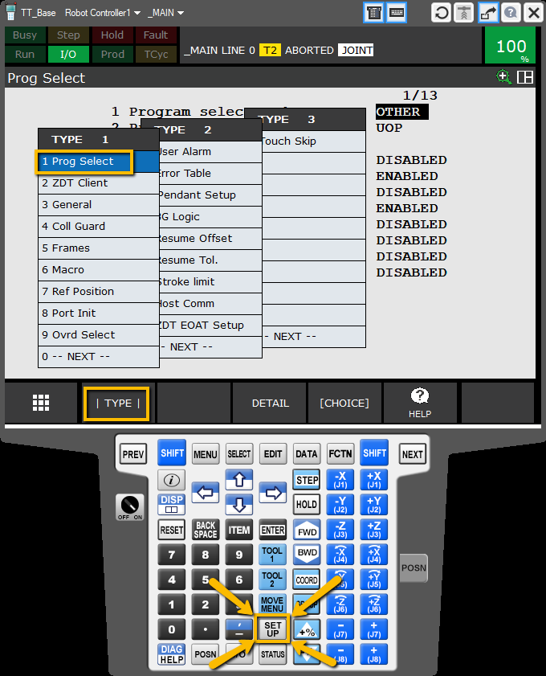
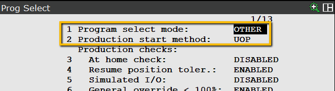
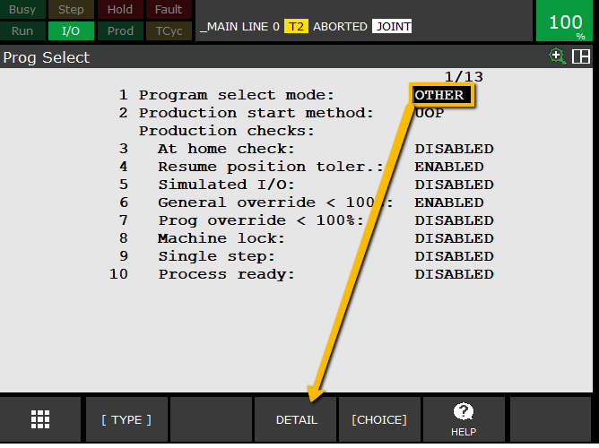
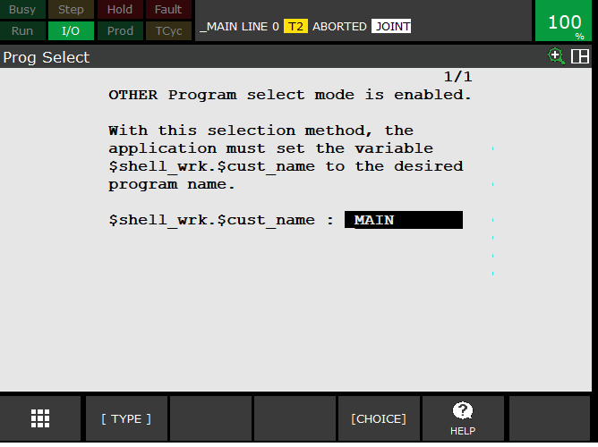
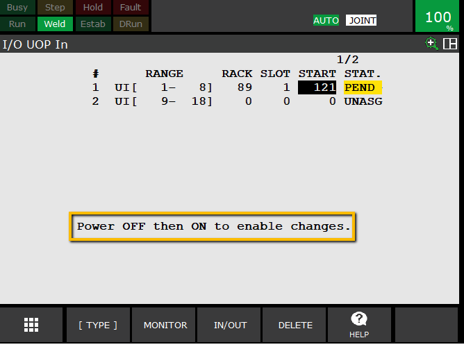
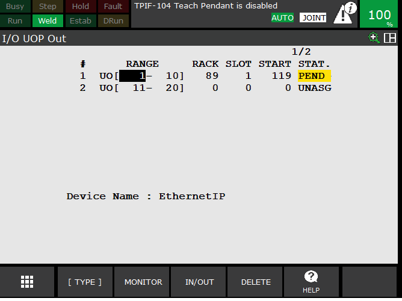
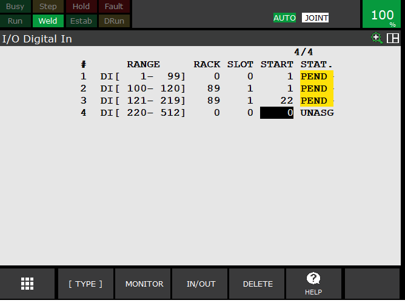
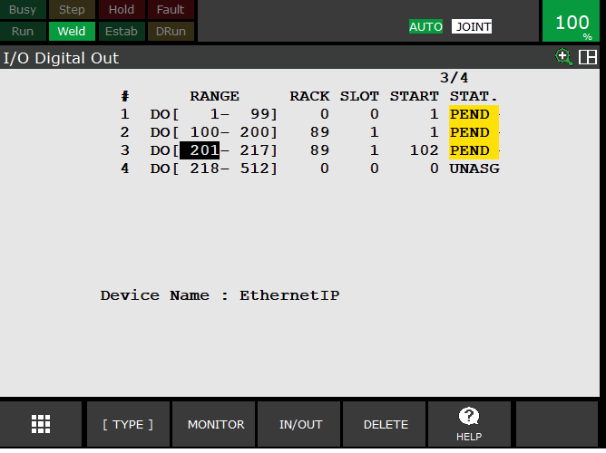

### UOP Configuration, Signal Mapping, and Handshake Logic Setup  

---

## 1. Setup the Program Select mode

**Steps**
1. First make sure they **Program select mode** is set to `OTHER` and the **Production start method** is set to `UOP`
    - Press `SETUP`
    - Select `|TYPE|` -> `1 Prog Select`

2. With `OTHER` selected press `DETAIL` 

3. Change the `$shell_wrk.$cust_name :` to **Name_of_your_main_program**

you can press choice and selet the program **Name_of_your_main_program** if you have already created the progam, or you can just type it in and create it later
> **Note:** The **OTHER** select mode with a progam named **_MAIN** is required by the **GRS**

---

## 2. Access the digital I/O from the menu

**Steps**
1. On the teach pendant, navigate to `MENU → I/O → Digital`.  
    - Press **F1**  `[TYPE]` to switch type and change to `UOP`
    - Press **F2** `CONFIG` to go to the configuration screen
    - Press **F3** `IN/OUT` to toggle between Inputs and Outputs.
2. Start with the **UOP Inputs** screen.
    - Press `CONFIG` to go to the configuration screen
3. Next we ar going to set `UI[1-8]` to RACK=89, SLOT=1, START=121

**RACK 89** is for ethernet
**SLOT 1** is for the PLC
**START 121** we will talk about why we chose this later.

The robot should show pending. Once we are done configuring the I/O we will need to power cycle for the changes to take effect.

---

## Common UOP Input Signals (go to monitor to view)

| Bit # | Signal Name | Function |
|-------|--------------|-----------|
| 1 | IMSTP | Immediate stop – fault generated **(ON)**|
| 2 | Hold | Slow stop – motion can resume **(ON)**|
| 3 | SFSPD | Safety signal required ON for operation **(ON)**|
| 4 | Cycle Stop | Pauses active program |
| 5 | Fault Reset | Resets faults from PLC or HMI |
| 6 | Start | Triggers robot program start |
| 7 | Home | Returns robot to home |
| 8 | Enable | Robot ready for external control **(ON)**|

> **Note:** signals marked **(ON)** must be held on for the robot to run

---

## 3. Setup UOP Output Signals
The steps are the same for the outputs but the start bit will be 119 because we are using 10 bits for the outputs

| Bit # | Signal Name | Function |
|--------|--------------|-----------|
| 1 | Cmd Enable | Ready for external start command |
| 2 | System Ready | On whe the **(ON)** bits are on and no faults |
| 3 | Pgr Running | Active program executing |
| 4 | Pgr Paused | Robot paused waiting for resume |
| 5 | Motion Held | Hold active, no motion commanded |
| 6 | Fault | Robot in fault state |
| 7 | At perch | Robot is on the first position of the program |
| 8 | TP enable | Teach Pendant on/off |

---

## 4. Setup digital I/O
below are sample config images for the digital inputs and outputs

---

#### Cycle Power to the robot for all changes to take effect